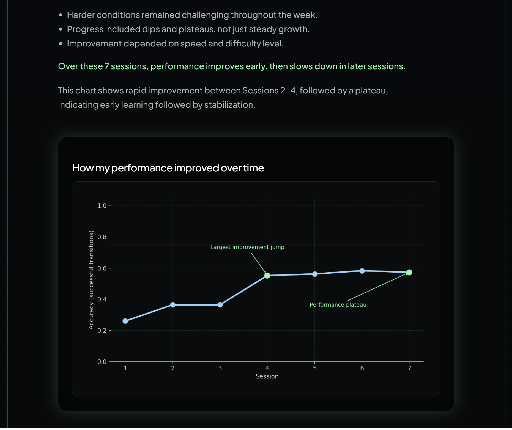
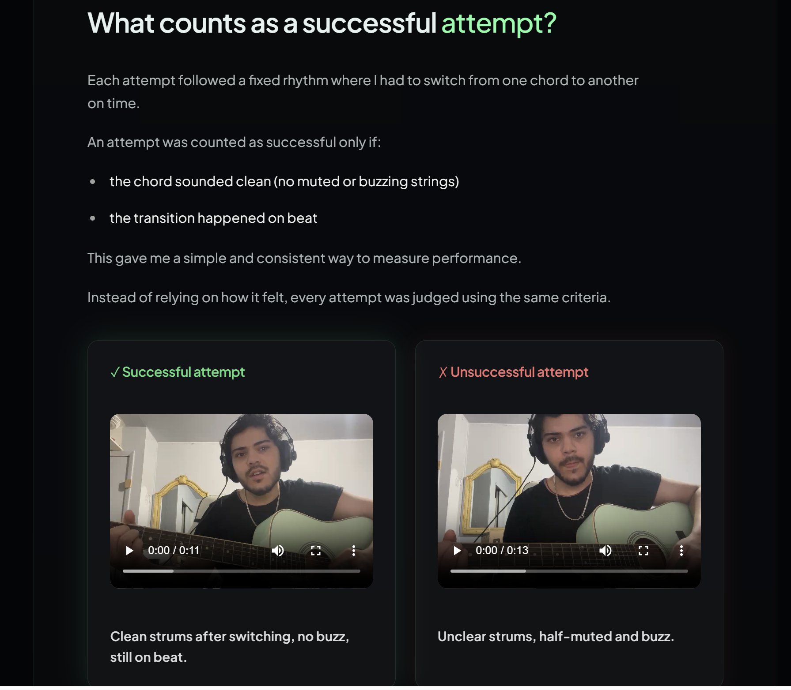

# Guitar Skill Acquisition Study

A structured, data-driven study measuring how a beginner improves guitar chord transitions (A ↔ E) under controlled time pressure.

Live Demo: https://rishav-guitar-research.vercel.app/

*Figure: Learning progression across sessions showing early improvement followed by stabilization.*

*Figure: Definition of a successful vs unsuccessful chord transition used for consistent labeling.*

## Overview

This project implements a controlled experiment to measure how a beginner improves at a motor skill under time constraints.

Instead of relying on subjective perception, performance is quantified using accuracy across varying speed (BPM) and difficulty levels. The goal is to transform practice — typically evaluated by intuition — into structured, measurable data.

---

## Problem

Skill improvement is usually judged subjectively, making it difficult to detect real progress or compare performance over time.

This project reframes practice as a measurable system, where performance can be tracked, compared, and analyzed under controlled conditions.

---

## Approach

The experiment spans 7 sessions (one per day), enabling analysis of how performance evolves over time under consistent conditions.
Each session was recorded and manually evaluated to ensure consistent labeling of performance.

Each session follows a fixed experimental structure:

* 4 difficulty modes
* 6 BPM levels: 60, 70, 80, 90, 100, 110
* 4 trials per (mode, BPM) condition

Difficulty is controlled through mode, which reduces the available time to switch chords.  
Speed is controlled through BPM, increasing overall time pressure.

By keeping the structure constant, performance differences reflect actual learning rather than randomness.

---

## Data Collection

Each session records performance for every (mode, BPM) combination.

- successful_trials: number of clean transitions (0–4)  
- clean_ratio = successful_trials / 4  

Each row represents a fixed condition, enabling direct comparison across sessions.

Dataset location:
data/main-data.csv

---

## Analysis

The analysis quantifies performance across three dimensions:

* Learning progression across sessions (trend over time)
* Performance degradation under increasing BPM
* Interaction between speed (BPM) and difficulty (mode)
* Threshold analysis (≥ 0.75 clean_ratio) to estimate reliable performance limits

All calculations are centralized in:
analysis/main_analysis.py

Derived outputs:
outputs/

---

## Key Insights

- Early learning shows rapid gains, followed by diminishing returns (typical learning curve behavior)
- Performance improves rapidly in early sessions, then slows, indicating initial adaptation followed by stabilization  

- Difficulty has a strong, non-linear impact on accuracy, with higher modes disproportionately reducing performance  

- Speed alone does not explain performance decline — its effect is amplified at higher difficulty levels  

- High accuracy thresholds are consistently achieved in easier modes but rarely reached in harder modes  

- Performance varies across sessions even under identical conditions, showing that short-term progress is inherently unstable  

---

## Reproducibility

All figures and results are generated from exported outputs.

To regenerate:
python analysis/main_analysis.py

To verify:
python analysis/verify_consistency.py

All plots read from outputs/*.csv to ensure consistency.

---

## Project Structure

data/       → raw dataset  
analysis/   → processing and plotting scripts  
outputs/    → computed results  
docs/       → experiment documentation  

---

## Reflection

Practice is not consistently progressive — variability is a core part of the learning process.

Recording performance reveals patterns that are not visible through perception alone.

---

## Limitations

- Single participant (n = 1)  
- Short duration  
- Manual data collection  

This project explores structured practice patterns, not generalizable conclusions.

---

## Takeaway

This project demonstrates how subjective skill development can be converted into a measurable system, enabling objective tracking, comparison, and analysis of progress over time.

By controlling variables and tracking performance over time, practice can be analyzed objectively rather than inferred from perception.

---

## What I Learned

* How to design controlled experiments for skill measurement
* Importance of consistent data collection protocols
* How variability affects short-term performance interpretation
* Translating subjective experiences into quantifiable metrics

---

## Tools

- Python  
- pandas  
- matplotlib  

---

## Run the Analysis

python3 -m venv .venv  
source .venv/bin/activate  
pip install -r requirements.txt  

python analysis/01_load_and_verify.py  
python analysis/main_analysis.py  
python analysis/verify_consistency.py  
python analysis/02_learning_progression.py  
python analysis/03_clean_ratio_vs_bpm.py  
python analysis/04_max_bpm_threshold.py  

Outputs saved to:
analysis/figures/
